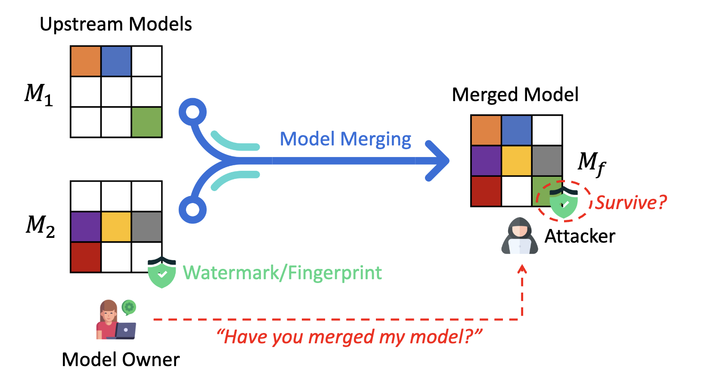

# MergeGuard


[](https://arxiv.org/abs/2404.05188) 


This is the official implementation for the paper "Have You Merged My Model? On The Robustness of Large Language Model IP Protection Methods Against Model Merging."

[](.)

## A. Prepare LLMs
- The LLMs used in our paper are [LLaMA-2-7B-hf](https://huggingface.co/meta-llama/Llama-2-7b-hf), [LLaMA-2-7B-CHAT-hf](https://huggingface.co/meta-llama/Llama-2-7b-hf), and [WizardMath-7B-V1.0](https://huggingface.co/WizardLM/WizardMath-7B-V1.0).
- `Watermarked LLMs`: We leverage [Quantization Watermarking](https://github.com/Twilight92z/Quantize-Watermark) to embed normal watermaks into LLaMA-2-7B-CHAT.
- `Fingerprinted LLMs`: We leverage [Instructional Fingerprint](https://github.com/cnut1648/Model-Fingerprint) to protect LLaMA-2-7B-CHAT.

## B. Merge LLMs
- We leverage [mergekit](https://github.com/arcee-ai/mergekit) to merge LLMs. You should download and install it first. The merging configurations used in our paper can be found in `/merge_config`. You can merge your LLMs as
  
```
mergekit-yaml merge_config/ties.yml [path_to_save_merged_model] --cuda
```

## C. Evaluation Performance
- We use [StrongReject-small](https://github.com/alexandrasouly/strongreject) dataset to evaluate the `safety alignment` within LLMs. You can run `eval_safe.py` to get the refusal rate results.
```
python eval_safe.py --model llama2-7b-chat
```

- We use [GSM8K](https://github.com/openai/grade-school-math) dataset to evaluate the `mathematical reasoning ability` of LLMs. You can run `eval_math.py` to get the prediction accuracy results.
```
python eval_math.py --model llama2-7b-chat
```

## Citation

If you find our work helpful, please cite it as follows, thanks!

```bibtex
@misc{cong2024mergeguardeval,
      title={Have You Merged My Model? On The Robustness of Large Language Model IP Protection Methods Against Model Merging}, 
      author={Tianshuo Cong and Delong Ran and Zesen Liu and Xinlei He and Jinyuan Liu and Yichen Gong and Qi Li and Anyu Wang and Xiaoyun Wang},
      year={2024},
      eprint={2404.05188},
      archivePrefix={arXiv},
      primaryClass={cs.CR}
}
